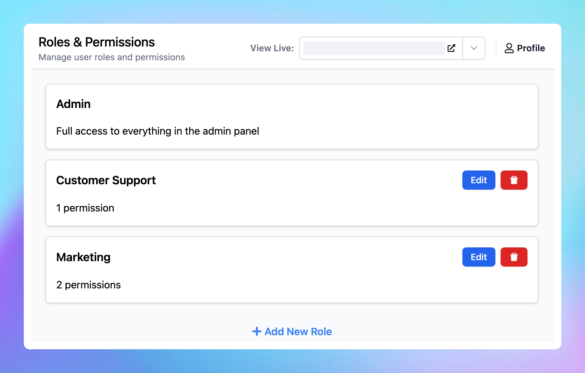

# Roles and Permissions

Running and managing a chat instance on your own can be challenging. Beyond managing users, you also need to train AI agents, monitor interactions, and ensure that AI responses are consistently high quality.

That’s where our advanced **Roles and Permissions** system comes in. This feature allows you to add team members to your chat instance, assign specific roles and permissions, and enable them to access the Admin Panel to support you in their designated functions.

This also give you - the instance owners more granular control over the permissions you give to your team members.

The new system is designed to be customizable and highly flexible, so let’s dive into the details to get a better understanding of how this advanced role and permission setup works on TypingMind!

## What are Roles and Permissions on TypingMind?

### TypingMind Roles

Instance owners can create **Custom Roles** within each chat instance.

You can define a variety of roles, each with a unique set of permissions, and then assign these roles directly to team members. 

This ensures that each person has access only to the features necessary for their role.

### TypingMind Permissions

**TypingMind permissions** determine what actions each role can perform within the Admin Panel. These permissions are assigned to roles, not individual users.

**For example**, if a role lacks the *View Chat Logs* permission, users assigned to that role will be unable to access the chat logs page. Similarly, if a role does not have the *View the API Keys page* permission, users in that role will be restricted from viewing or configuring API keys.

<aside>
💡

**Previously,** TypingMind included two predefined roles: Admin and Content Moderator.

The Admin role will remain as the role with the highest level of permissions and will be available by default.

However, the Content Moderator role will be removed. We provide you with more flexible options instead - custom-defined roles that better suit your team’s specific needs. 

</aside>

### Why use TypingMind Roles and Permissions?

- **Flexibility and control:** bundle the required permissions into the right roles and assign them to users across the organization to suit your workflow needs.
- **Security and compliance:** minimize security risks by granting only necessary permissions to your users with custom roles.
- **Improved productivity:** custom roles ensure that users access only the necessary parts of the chat instance Admin Panel relevant to their functions, avoiding overwhelm.
- **Scalability:** custom roles simplify permission management as teams grow and ensure the right people have the right access.

## A full list of TypingMind permissions

Let’s take a look at all available permissions for the access to your Admin Panel! 

| Feature | Control |
| --- | --- |
| **Models** | Full access to manage LLM models (OpenAI, Anthropic, Gemini, custom models) |
| **Plugins** | Full access to manage Plugins |
| **AI Agents** | Full access to manage AI agents and related agents settings: plugins, models, usage limits, and knowledge base. |
| **Reporting** | - View analytics
- Full access to manage chat logs
- Full access to manage email reports |
| **Billing** | - View billing details
- Full access to manage billing |
| **User Management** | - View users
- Full access to manage users (invite, remove, update profile, etc.)
- Full access to manage user authentication settings (SSO, SAML, OAuth, etc.)
- Full access to manage instance access control (public/authorized/private mode)
- Full access to manage usage limits
- Full access to manage roles & permissions |
| **API Keys** | - View the API Keys page
- Full access to manage API keys |
| **Knowledge Base** | - View data from the Knowledge Base
- Full access to manage data from the knowledge base |
| **Portal Settings** | Full access to manage Portal Settings (branding, domain, chat features, etc.) |
| **Prompt Library** | Full access to manage Prompt Library |
| **System Prompts** | Full access to manage Global System Instruction, Global Few-shot Prompting, etc. |
| **Integrations** | Full access to manage integrations (Chat Widget, API integration). |

## Guideline to create roles and permissions

You can create custom roles with specific permissions via the Admin Panel:

- Log into the **Admin Panel**
- Toggle the **User Management** section
- Click on **Roles and Permissions**
- Click on **Add New Role**

**Example roles:**

1. **Role: Customer support**

Custom support role is for team members who respond to customer inquiries. They need access to chat logs to understand customer issues and provide solutions.

Permissions:

- Use Management
    - View users
- Reporting
    - Full access to manage chat logs

1. **Role: Content curator**

Content Curator role is allowed to upload knowledge base to train the AI Agents and use the prompt library to produce marketing content.

Permissions:

- Knowledge Base
    - View data from the Knowledge Base
    - Full access to manage data from the knowledge base
- Prompt Library
    - Full access to manage Prompt Library
- AI Agents
    - Full access to manage AI agents and related agents settings: plugins, models, usage limits, and knowledge base.

1. **Role: Team lead**

Team leads need to manage users, monitor all customer interactions, and ensure that the team is following best practices.

Permissions:

- Reporting:
    - View analytics
    - Full access to manage chat logs
    - Full access to manage email reports
- User Management:
    - View users
    - Full access to manage users (invite, remove, update profile, etc.)
- Billing:
    - View billing details
    - Full access to manage billing

<aside>
💡

To update permissions within a role, click on Edit button next to each role. 

</aside>

## Guideline to add roles to members

After done creating the custom roles, you can assign these roles to your members within the chat instance: 

- Go to **User List**
- Select a user account
- Navigate the **Role** section and select a Role you created via the Role and Permissions page

- Users who are assigned roles will be able to log into the Admin Panel and use the features they have permissions only:

<aside>
💡

Each user can be assigned multiple roles.

When a user is assigned multiple roles with overlapping permissions, they will automatically inherit permissions from the role with the highest access level.

Soon, you'll also be able to assign roles to a **User Group** - a collection of users who share the same category (such as department, function, etc.).

</aside>

## There’s more to come!

We’re continually enhancing our platform, and more permissions will be added to help you better control your user access to the Admin Panel!

Stay tuned for more updates!