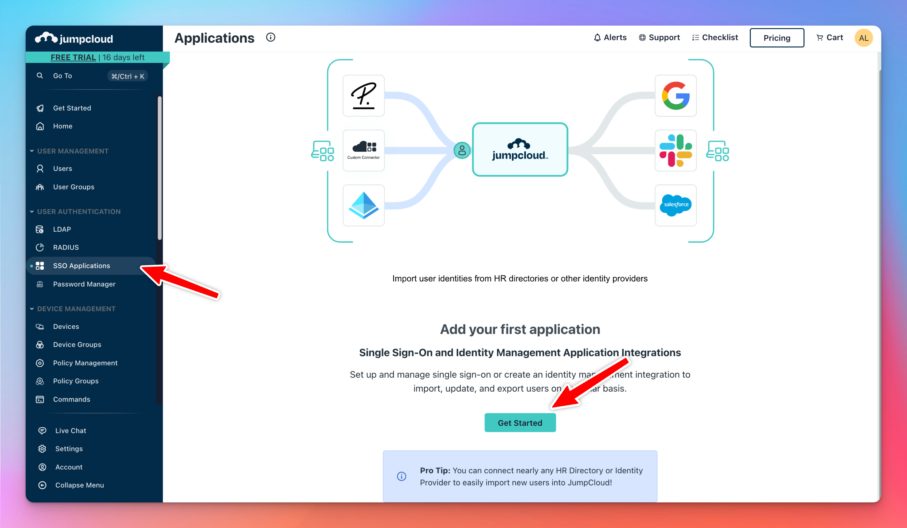

# Set up SSO via JumpCloud

Follow this guide to integrate Single Sign-On (SSO) for your instance by creating an application in JumpCloud and configuring the SSO connection.

 

## **Step 1: Create an SSO Application**

1. **Access SSO Applications**
    - Log in to the JumpCloud Admin Dashboard.
    - Select **SSO Applications** from the left menu.
    - If you don't have any SSO applications yet, click **Get Started** to create a new one.

1. **Create a Custom Application**
- In Step 1, select **Custom Application**.

- In Step 2, select **Manage Single Sign-On** and click **Configure SSO with SAML**.

- In Step 3, provide basic information for the application. For example:
    - **Application Name**: Use a name such as **Your Instance Name**.

- Review your setup and, if satisfied, click **Configure Application** to complete the process.

## **Step 2: Configure the SSO Application**

After creating the application, you need to set up its SSO configuration.

1. **Open Application Settings**
    - Select the newly created application and go to the **SSO** tab.

1. **Fill in SSO Details**

Configure the SSO settings as follows:

- **IdP Entity ID**: Enter `JumpCloud`
- **SP Entity ID**: Enter the value from the connection you created in your TypingMind instance. For this guide, use `https://test2.tdinh.me`
- **ACS URLS**: For this guide, enter `https://test2.tdinh.me/api/oauth/saml`

1. **Add User Attributes**

Scroll down to add the following attributes:

- Attribute Name: **email** → Attribute Value: **email**
- Attribute Name: **firstName** → Attribute Value: **firstname**
- Attribute Name: **lastName** → Attribute Value: **lastName**

Make sure you also check the **Declare Redirect Endpoint** checkbox.

1. **Add user groups**

Choose the user groups that you want to grant access to logging in with Single Sign-On (SSO).

1. **Export Metadata**

 Once all fields are filled correctly:

- Scroll to the top and click **Export Metadata** to download the XML file.
- Click **Save** to finish.

## **Step 3: Finalize SSO Configuration in Your Instance**

1. **Paste Metadata XML**
    - Copy the content of the XML file you exported from JumpCloud and paste it into the corresponding configuration section.
    - Click **Save** to finalize the SSO connection setup.

1. **Login to your instance using JumpCloud SSO**

You have successfully set up SSO for your instance using JumpCloud. Your users will see a new button “Use Single Sign-On (SSO)” in the login popup.

