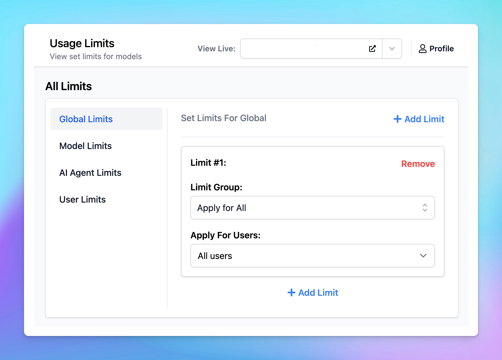

Managing AI resources effectively for your chat instance is more important than ever. 

That’s why we've revamped our Usage Limits system which provides you with better control over your AI resources! 

This guide will walk you through the different types of usage limits you can set - **Global Limits**, **Model Limits**, **AI Agent Limits**, and **User Limits -** and how to implement them step by step.

# Why Usage and Limits Matter?

With TypingMind, you can set up multiple AI Agents and prompts, enabling your team to interact with various AI models. 

While this flexibility enhances productivity, it also requires careful management to control API costs. Setting usage limits helps you:

- **Prevent overuse:** make sure that no single AI model, agent, or user consumes an excessive amount of resources.
- **Optimize costs:** keep expenses in check by regulating usage.
- **Enhance fairness:** distribute AI capabilities evenly across users or departments

<aside>
💡 This is particularly beneficial for resellers, who can create different limit tiers for various user groups based on their needs. 

More details on our [Reseller Program](https://custom.typingmind.com/reseller)

</aside>

# How Usage Limits work

Basically, you can set limits based on:

- **Message limits:** the number of messages a user or group can send.
- **Character limits per message:** the maximum number of characters allowed in a single message.
- **Character limits per time period:** the total number of characters a user or group can send within a specific time frame.

These limits are managed via **Limit Groups**.

<aside>
💡 **Using Limit Groups allows admins to reuse the limits you've already set up**. 

Once you've created a Limit Group with specific restrictions, you can apply that group across different settings - whether for different AI models, agents, or user groups - without having to redefine the limits each time.

</aside>

You can **apply the limits from your Limit Groups** in four different levels:

1. **Global Limits:** apply limits to all users or specific groups across the entire chat system.
2. **Model Limits:** set limits for each specific AI model, which can apply to all users or specific user groups.
3. **AI Agent Limits:** apply limits to individual AI Agents for all users or specific groups.
4. **User Limits:** set limits for individual users.

Let’s see how to set up these limits for your chat instance!

# A step-by-step to set up usage limits

## Step 1: Set up User Groups

Before setting limits, it's helpful to organize users into different groups. This allows you to apply specific limits to different categories of users.

- Go to the **Group** under the **User Management** section
- Click to Create a new user group
- Add members to your created group

You can view more details guideline on how to create user groups here: 

[Create and manage User Groups](/typingmind-team/user-management/create-and-manage-user-groups)

/image%2020.png)

## Step 2: Create Limit Groups

- Within your Admin Panel, go to Usage Limits within Access & Limits menu
- Scroll down to Limit Groups
- Click on “**Add New Group**”

- Define the limits for your group by setting:
    - Message Limits
    - Character Limits Per Message
    - Character Limits Per Time Period
    
    (If a particular limit is not needed, you can leave that field blank)
    

For example, you can create different limit groups as follows:

- **Basic Use**: 50 messages can be sent per 3 hours - suitable for users who need minimal interaction with AI, such as those who send fewer messages or shorter content.
- **In-depth Use**: 200 messages can be sent per 3 hours - for users who require extensive AI interactions, allow sending more messages and longer content.

These Limit Groups are reusable, which means once you've created them, you can apply them to different AI Models, AI Agents, or individual Users without needing to redefine the limits each time.

## Step 3: Apply Usage Limits

You can now apply the limits in the following ways:

- Global limits
- Model limits
- AI Agent limits
- User limits

Go to **User Management** —> **Usage Limits** to set up the limits.

### 1. Global Limits

To apply limits across all users or specific groups:

- Click on **Global Limit**.
- Select the desired **Limit Group** from the drop-down menu.
- Choose the user groups to which these limits will apply.

**For example:** Apply “Basic Use” limit group you created previously for All Users.

### 2. Model Limits

To apply limits to specific AI models:

- Click on **Model Limits**.
- Select the AI model you want to restrict.
- Choose the appropriate Limit Group.
- Assign these limits to a specific user group.

**For example**,  if the "Content Team" uses GPT-4o more frequently, you might set tighter restrictions on that model for this group - with GPT-4o, set “In-depth Use” for “content” group

### 2. AI Agent Limits

To restrict usage per AI Agent:

- Click on **AI Agent Limits**.
- Select the AI Agent you want to restrict.
- Choose a Limit Group.

- Apply these limits to the relevant user group.

**For example:** If the Support Agent is primarily used by the "Support Team" and less by the "Marketing Team," you can set different limits for this agent tailored to each group's usage needs:

- Basic Use for Marketing Team
- In-depth Use for Support Team

### 3. User Limits

To set limits for individual users:

- Select the user you want to restrict.
- Choose a Limit Group from the list.

**For example:** If a particular user consistently exceeds usage limits, you can apply a stricter Limit Group specifically for them.

## Step 4: Monitor Limits in the Chat Interface

Users who have restrictions applied will see a notification below the message area stating, "The current chat may come with limitations. **See details**." 

You can hide this notification via the Chat Features section within the Portal settings if you want.

# Best Practices

Some best practices so you can effectively manage AI usage:

- **Start conservatively**: start with stricter limits and adjust them as you gather actual usage data through chat logs or the analytics dashboard.
- **Review regularly**: regularly review and update limits to align with changing needs and usage patterns.
- **Adapt to new AI Models**: test new AI models to evaluate their performance and cost-effectiveness, then adjust your usage limits accordingly if you think the new model is a better fit for your team.

# Notes

- The old **Model Usage Limits (Legacy)** will still be available, but we recommend moving your limit settings to the new Usage Limits system for better control and management.
- Currently, if you want to set Model Availability for specific user groups without using limit groups, you can scroll down to **Model Usage Limits (Legacy)** to adjust availability. We will be updating this option within the new Usage Limits system soon!

We are actively enhancing the Usage Limits system to offer even greater control and flexibility, so stay tuned for updates that will further improve your experience!