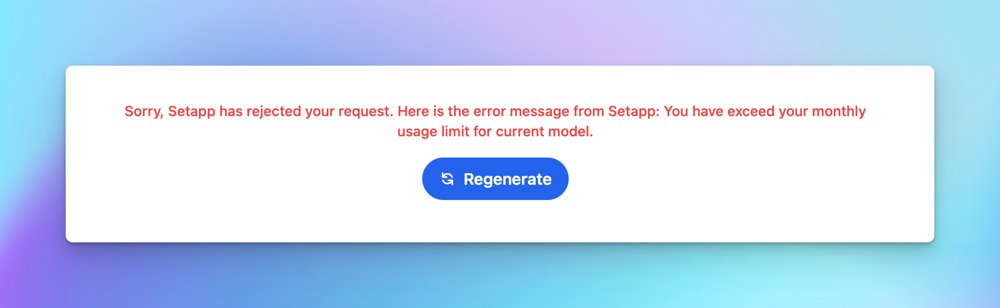

# Setapp Limitation

“**Sorry, Setapp has rejected your request. Here is the error message from Setapp: You have exceed your monthly usage limit for current model.”** 

If you encountered this error message while using TypingMind via SetApp, then you may have reached the usage limit set by SetApp when using their AI models.

## What is SetApp limitation?

According to [SetApp's official document](https://support.setapp.com/hc/en-us/articles/9165363863068-Limitations-in-Setapp-apps), when you use the AI apps with their free chat models, there's a credit limit based on your SetApp subscription plans.

TypingMind is one of the apps that has this restriction. So sorry that we can’t do anything about this.

## Use your own API key instead

To use TypingMind without any limits, you can enter your own API key and switch the chat models from SetApp models to other AI models.

Here’s the detailed guideline to get your API key: 

[OpenAI (GPT-5, GPT-4.1)](../Manage%20&%20Connect%20AI%20Models/OpenAI%20(GPT-5,%20GPT-4%201)%2097b6ce8cbb6642a9934e81f7b7365575.md)