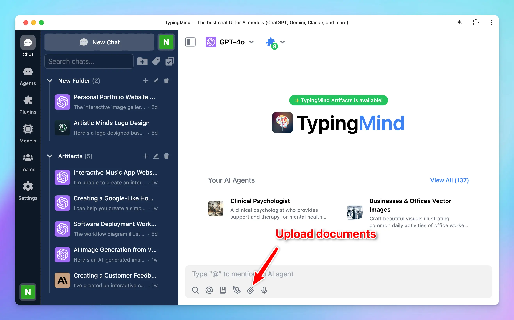
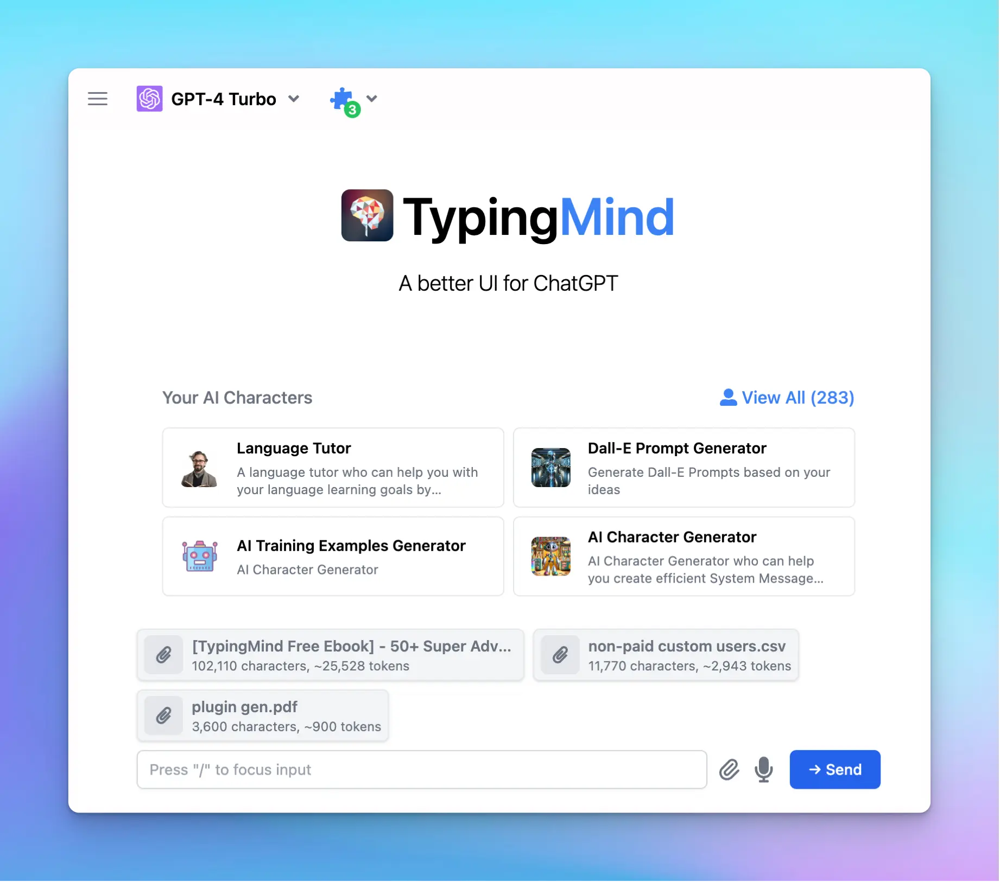

A step-by-step on how to upload your training documents on TypingMind and let the AI model to interact with your data to answer your queries.

<Note>
  Please note that this is the guideline to attach training data to your conversation.

  The attached data will be treated as the first prompt to the AI model. Therefore, when the AI model’s context length is reached, it will automatically forget the attachments.

  If you want the AI model to always remember your uploaded document no matter how much the messages you send or context tokens you use, you can upload your documents as training files via AI Agent set up, [learn more](https://docs.typingmind.com/ai-agents/ai-agents-overview#dea59713457945979e839a0defc1c015).
</Note>

## Step-by-step to upload your files to TypingMind

1. Click the **“Upload”** icon or drag your file to the message area

2. **Browsing** through your file directory and choose files you want to interact with. Please note that you can upload multiple files within a conversation

## Important notes

Please take note of the following key points:

- Our system **supports** Markdown, PDF, CSV, XLSX, TXT, DOCX, JSON, HTML
- Image files (such as .jpeg, .jpg, .webp) can be used via models that support vision.
- Make sure that the **tokens in your PDF fall within the model's maximum context length.**
- If you want to upload training data for your AI Agent, please take a look at [AI Agent Overview](/ai-agents/ai-agents-overview)